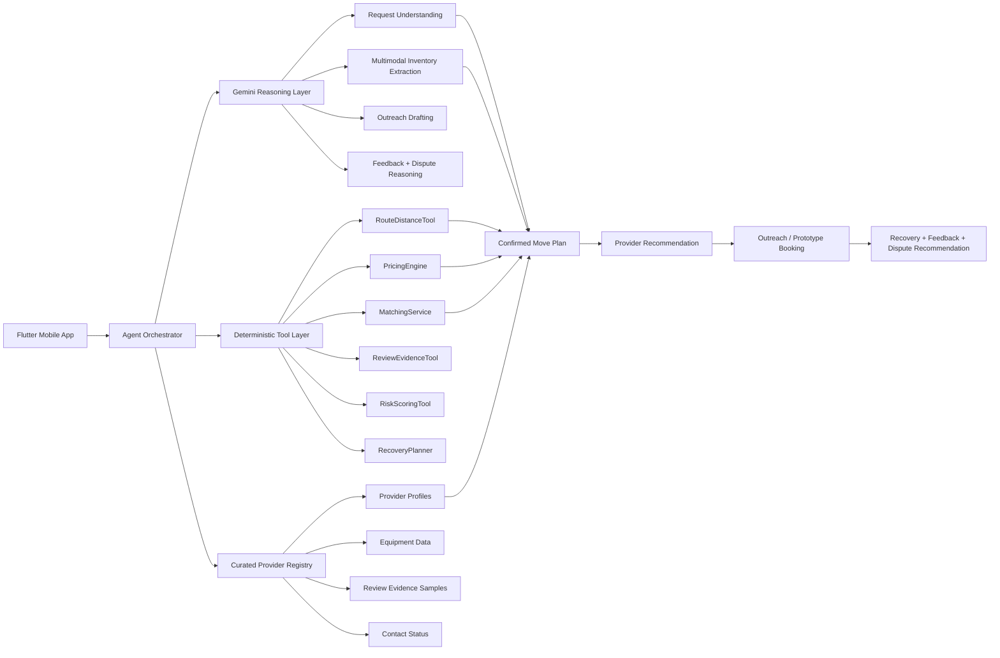
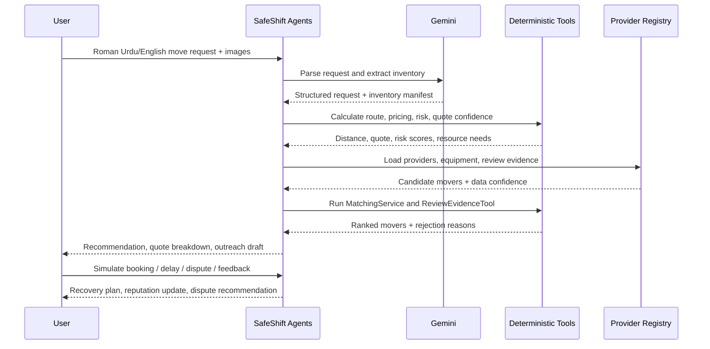

# SafeShift AI

## Agentic Moving-Service Orchestrator for Pakistan's Informal Economy

> **Challenge 2: AI Service Orchestrator for Informal Economy** — #AISeekho 2026 Google Antigravity Hackathon

**SafeShift AI** is a mobile-first agentic service orchestration MVP for Pakistan's informal movers and packers economy. It helps families plan safer home shifting by understanding Roman Urdu/English moving requests, extracting inventory from text and room/item images, calculating route distance, estimating transparent quotes, ranking movers through trust and risk evidence, preparing outreach/job briefs, and simulating booking, recovery, feedback, and dispute workflows.

Gemini powers request understanding, multimodal inventory extraction, outreach drafting, feedback analysis, and dispute reasoning. Deterministic tools handle route distance, pricing, matching, risk scoring, quote confidence, and recovery planning so decisions remain auditable and non-hallucinated.

---

## Team Members

| Name | Role |
|---|---|
| **Muhammad Awais** | Team Lead — product direction, AI workflow design, Flutter implementation, testing, documentation, demo preparation |
| **Abdul Raffay** | Team Member — development support, testing/review support, submission preparation |

---

## Table of Contents

- [Problem Statement](#problem-statement)
- [Challenge 2 Alignment](#challenge-2-alignment)
- [Core Workflow](#core-workflow)
- [System Architecture](#system-architecture)
- [Agentic Orchestration Philosophy](#agentic-orchestration-philosophy)
- [Agents Developed](#agents-developed)
- [Key Features](#key-features)
- [APIs, Data Sources, and Honesty Boundaries](#apis-data-sources-and-honesty-boundaries)
- [Provider Data Provenance](#provider-data-provenance)
- [Pricing and Matching Logic](#pricing-and-matching-logic)
- [Real vs Simulated Components](#real-vs-simulated-components)
- [Tech Stack](#tech-stack)
- [How to Run](#how-to-run)
- [Testing and Build](#testing-and-build)
- [Cost, Latency, and Scalability](#cost-latency-and-scalability)
- [Limitations](#limitations)
- [Future Improvements](#future-improvements)

---

## Problem Statement

Pakistan's home-shifting market is highly informal. Families often find movers through referrals, roadside loaders, WhatsApp contacts, OLX, Facebook pages, or Google listings. This creates major uncertainty around quote accuracy, punctuality, fragile-item handling, equipment fit, and damage accountability.

Common pain points include:

- Hidden stair/loading/parking charges after loading begins
- No written inventory or quote protection
- Fragile items damaged due to weak packing/equipment
- Late arrivals and cancellations with no backup plan
- No structured evidence for damage disputes
- No easy way to compare mover trust, equipment, and hidden-charge risk
- Requests often written in Roman Urdu, Urdu, English, or code-switched language

SafeShift AI turns a messy informal moving request into a structured, evidence-backed service workflow.

---

## Challenge 2 Alignment

SafeShift AI directly targets **Challenge 2: AI Service Orchestrator for Informal Economy**.

It demonstrates:

- Multilingual/noisy request understanding
- Provider discovery and source-confidence handling
- Multi-factor provider ranking
- Transparent price estimation
- Scheduling conflict reasoning
- Confirmation/outreach actions
- Delay/cancellation recovery
- Feedback and reputation updates
- Damage dispute escalation
- Baseline comparison against simple price/rating sorting
- In-app Agent Trace Mode and external Antigravity trace/log documentation

The app is designed to show visible agentic behavior:

```text
Observation → Inference → Decision → Tool/API Call → Tool Result → Action → Fallback/Recovery → Outcome
```

---

## Core Workflow

1. User enters a moving request in English/Roman Urdu.
2. User selects pickup and drop-off locations.
3. Route & Distance Agent calculates distance using Google Routes when configured or OpenStreetMap/Haversine fallback.
4. User uploads room/item images or enters inventory manually.
5. Gemini multimodal reasoning extracts a structured inventory manifest.
6. Irrelevant/private/selfie images are rejected for accuracy and privacy.
7. User confirms or edits item quantities, fragility, weight class, wrapping/disassembly needs, and confidence.
8. Move Type and Risk Agents classify the move and required resources.
9. Pricing Agent calculates transparent quote breakdown.
10. Review Evidence and Matching Agents rank movers by trust, price, equipment, route, and risk.
11. AI Outreach Assistant creates a mover-facing job brief and Roman Urdu/English contact draft.
12. The MVP simulates booking, protection hold, recovery, feedback, reputation updates, and dispute recommendations.
13. Baseline comparison shows why SafeShift is better than simple price/rating sorting.
14. Agent Trace Mode exposes decision steps for judges.

---

## System Architecture



### Agentic Workflow



---

## Agentic Orchestration Philosophy

SafeShift is not just a listing app. It uses Gemini/Antigravity for request understanding, evidence reasoning, decision explanation, outreach drafting, feedback analysis, and dispute reasoning. The agents call deterministic tools for pricing, matching, route distance, and risk scoring.

This design avoids unreliable LLM-generated operational numbers. The AI decides which tools to call, interprets the tool results, and explains the final decision.

---

## Agents Developed

| Agent | Role | Output |
|---|---|---|
| Request Understanding Agent | Parses English/Roman Urdu moving requests | Service type, pickup, drop-off, inventory hints, time, budget, constraints |
| Image Relevance & Inventory Validation Agent | Rejects irrelevant/private/selfie images | Valid/invalid image status, privacy-safe warning |
| Inventory Manifest Agent | Merges text, image, and manual inventory | Confirmed manifest with quantity, fragility, weight class, confidence |
| Move Type Classifier Agent | Classifies move type | Full home shifting, one-item move, furniture-only, office shifting, etc. |
| Route & Distance Agent | Calculates route distance | Google Routes live distance when configured; OSM/Haversine fallback otherwise |
| Provider Discovery Agent | Loads candidate movers | Curated provider profiles, source confidence, contactability |
| Review Evidence Agent | Analyzes evidence samples | Hidden-charge, damage, punctuality, fragile-handling signals |
| Matcher & Ranker Agent | Scores providers | Match score, why selected, why risky/rejected |
| Pricing Agent | Calls deterministic PricingEngine | Transparent quote breakdown |
| Quote Confidence Agent | Rates quote certainty | High/medium/low confidence based on route/inventory/evidence completeness |
| Hidden-Charge Protection Agent | Verifies declared scope | Quote-lock checklist and surcharge conditions |
| AI Outreach Assistant | Creates mover-facing job brief | Roman Urdu/English contact draft and driver checklist |
| Scheduling & Recovery Agent | Handles preferred time and failure | Delay/cancellation recovery plan and backup logic |
| Damage Dispute Agent | Reviews evidence for damage claims | Non-binding compensation recommendation; human review required |
| Reputation Update Agent | Updates simulated reputation signals | Punctuality, transparency, fragile handling deltas |
| Baseline Comparison Agent | Compares SafeShift vs traditional sorting | Risk-score comparison and explanation |

---

## Key Features

### Multimodal Inventory Manifest

Users can upload multiple room/furniture/item photos. Gemini multimodal reasoning extracts moving-relevant inventory into structured items, including:

- Quantity
- Source: text, image, manual, or mixed
- Confidence
- Fragile/heavy/bulky flags
- Approximate weight class
- Handling difficulty
- Wrapping/disassembly needs
- Packing material needs
- Risk flags

The user confirms or edits the manifest before pricing and matching. Exact weights are not claimed; the app uses approximate classes and confidence levels.

### Route and Location Evidence

SafeShift uses OpenStreetMap tiles for visual map display. When Google API keys are configured, Google Routes API can provide live driving distance/ETA. If Google APIs fail or keys are missing, the app falls back to saved coordinates and Haversine × 1.3 approximate road distance.

### Risk-Aware Provider Ranking

SafeShift does not simply sort by rating or price. It ranks movers using route distance, inventory risk, source confidence, review evidence, equipment fit, hidden-charge risk, damage complaints, budget preference, and quote confidence.

### AI Outreach Assistant

For public/unregistered movers, SafeShift generates a contact draft instead of pretending to send a real message. For demo-registered partners, simulated chat/booking is clearly labeled as prototype behavior.

### Recovery and Dispute Flow

The app can simulate provider delay/cancellation recovery, structured feedback, reputation updates, and damage-dispute recommendations. No real payment, real escrow, real WhatsApp sending, or real payout is processed.

---

## APIs, Data Sources, and Honesty Boundaries

| Component | Type | Purpose |
|---|---|---|
| Gemini API | Real when key configured | Request parsing, multimodal inventory, outreach drafting, feedback analysis, dispute reasoning |
| Google Routes API | Real when key configured | Live route distance/ETA for pricing and matching |
| OpenStreetMap tiles | Real map display | Map visualization and fallback continuity |
| Haversine × 1.3 | Deterministic fallback | Approximate road-distance estimate |
| Curated provider registry | Curated MVP data | Provider profiles, source confidence, equipment, contact status |
| Synthetic review samples | Synthetic MVP samples | Review-evidence demo for hidden-charge/damage/punctuality reasoning |
| Booking / quote lock | Simulated | Prototype booking and protection workflow |
| WhatsApp/contact | Draft/simulated | Outreach draft; no real message sending |
| Dispute compensation | Recommendation only | Human review required; no real payout |

---

## Provider Data Provenance

SafeShift uses a curated MVP provider dataset with contact status and data-confidence labels.

| Provider | Source Type | Registered on SafeShift | Contact Method | Data Confidence | Review Evidence |
|---|---:|---:|---|---:|---|
| Reliable Packers and Movers | Google Maps / public listing | Demo registered partner | Simulated demo response | 95% | Synthetic/mock review samples |
| Costa Logistics | Company website + Google Maps | No | WhatsApp draft | 90% | Synthetic/mock review samples |
| Zain Packers & Movers | OLX Pakistan | No | WhatsApp draft | 82% | Synthetic/mock review samples |
| Marshall Packers | Google Maps / public listing | No | WhatsApp draft | 80% | Synthetic/mock review samples |
| Budget Loaderz | Fictional/mock informal loader profile | No | Demo outreach only | 40% | Synthetic/mock review samples |

### Honesty Vocabulary

The project intentionally uses honest language:

- "Curated public-source provider dataset" instead of "scraped every review"
- "Available review evidence" instead of "verified public truth"
- "AI-generated contact draft" instead of "automatically contacted mover"
- "Simulated booking action" instead of "real booking confirmed"
- "Prototype provider response" instead of "real-time driver negotiation"
- "Google Routes live distance" if the API succeeds
- "OpenStreetMap fallback / approximate distance" if fallback is used

---

## Pricing and Matching Logic

### Pricing Formula

```text
Quote = Base Transport
      + Distance Fee
      + Vehicle / Crew Fit
      + Fragile Item Handling
      + Heavy / Bulky Surcharge
      + Disassembly / Wrapping
      + Stairs / No-Lift Surcharge
      + Packing / Material Estimate
      + Quote Confidence / Unverified Buffer
```

Pricing is deterministic and transparent. If the confirmed inventory changes, the app warns that the quote may change.

### Matching Factors

The Matcher & Ranker Agent considers:

- Source confidence
- Rating and review count
- Hidden-charge complaints
- Damage complaint risk
- Fragile-handling evidence
- Equipment fit
- Crew/truck fit
- Route coverage and distance suitability
- Price fairness
- User budget preference
- Red flags and provider reliability

---

## Real vs Simulated Components

| Feature | Status |
|---|---|
| Flutter mobile app | Implemented |
| Gemini request parsing | Real when API key configured |
| Gemini image inventory | Real when API key configured |
| Google Routes distance | Real when API key configured |
| OpenStreetMap fallback | Implemented |
| Provider dataset | Curated MVP data |
| Review samples | Synthetic MVP samples unless marked otherwise |
| Booking | Simulated |
| WhatsApp/contact | Outreach draft; not real sending |
| Payment/quote lock | Simulated quote lock only |
| Dispute compensation | Recommendation only; human review required |

---

## Tech Stack

| Layer | Technology |
|---|---|
| Frontend | Flutter / Dart |
| State Management | Provider |
| AI Reasoning | Gemini via `google_generative_ai` |
| Multimodal Input | `image_picker` + Gemini multimodal reasoning |
| Map Display | `flutter_map` + OpenStreetMap tiles |
| Coordinates | `latlong2` |
| Location | `geolocator` where permissions allow |
| Routing | Google Routes API when configured; Haversine fallback |
| Styling | Dark glassmorphic UI, Google Fonts / Outfit, animations |
| Documentation | Markdown + Antigravity trace logs |

---

## How to Run

```bash
# 1. Install dependencies
flutter pub get

# 2. Create a local environment file
cp .env.example .env

# 3. Add your local keys in .env
GEMINI_API_KEY=your_key_here
GOOGLE_MAPS_API_KEY=your_key_here
GOOGLE_PLACES_API_KEY=your_key_here
GOOGLE_ROUTES_API_KEY=your_key_here

# 4. Run the app
flutter run
```

> Security: never commit real API keys. Keep `.env` local and commit only `.env.example`.

---

## Testing and Build

```bash
flutter analyze
flutter test
flutter build apk --debug
```

Recommended hackathon flow:

1. Build debug APK.
2. Test the APK on a physical Android phone.
3. Upload the tested APK to Google Drive.
4. Set Drive access to "Anyone with the link can view/download."

---

## Cost, Latency, and Scalability

Gemini calls are used for parsing, image analysis, outreach drafting, feedback analysis, and dispute reasoning. Google Routes calls are optional and used only when keys are configured. OpenStreetMap fallback and deterministic tools are low-cost and low-latency.

At 10x scale, provider data should move to Firebase or a managed cloud database, route/provider lookups should be cached, and provider onboarding should be added. At 100x scale, matching, pricing, recovery, and disputes should become separate services with city-wise provider clusters and event-driven recovery.

---

## Limitations

- Curated provider data rather than live scraping
- Synthetic review samples unless explicitly marked otherwise
- No real WhatsApp Business API integration
- No real payment, escrow, or payout processing
- No production provider verification
- Gemini outputs require user confirmation
- Route fallback can be approximate

---

## Future Improvements

- Google Places provider discovery
- Verified provider onboarding and driver app
- WhatsApp Business API integration
- Payment protection integrations
- Real customer feedback network
- Insurance/repair partnerships
- Production dispute workflow
- Richer traffic/route support

---

## Demo Flow

```text
Onboarding
→ Request input
→ Route selection
→ Image inventory
→ Manifest confirmation
→ Risk analysis
→ Schedule analysis
→ Mover ranking
→ Quote breakdown
→ Outreach/job brief
→ Prototype booking
→ Recovery/dispute
→ Feedback/reputation
→ SafeShift advantage screen
→ Agent Trace Mode
```

---

## Submission Notes

- Mobile APK is uploaded separately as a Google Drive link.
- README/documentation PDF is submitted separately in the form.
- Antigravity trace/log ZIP is submitted separately.
- GitHub repository should exclude `.env`, `.mcp.json`, `.vscode/`, `.idea/`, `build/`, `.dart_tool/`, and `*.apk`.
